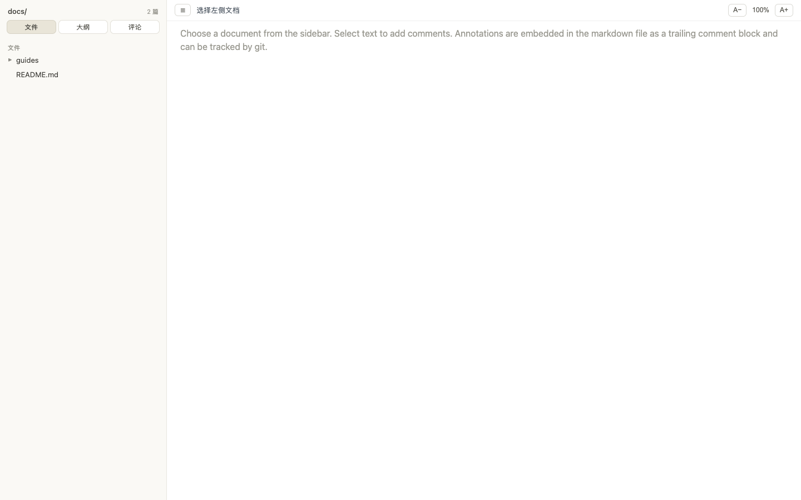
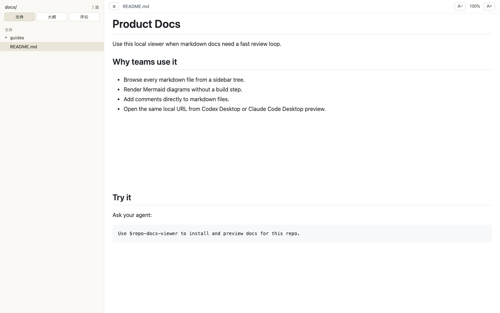

# Repo Docs Viewer Skill

[](https://skills.sh/shanexi/repo-docs-viewer-skill)

Turn a repo's markdown docs into a local preview site your coding agent can install, validate, and open.

## Quick Start

Install the skill:

```bash
npx skills add shanexi/repo-docs-viewer-skill --skill repo-docs-viewer
```

Then ask your agent:

```text
Use $repo-docs-viewer to install and preview docs for this repo.
```

The agent will run the zero-build viewer, validate the routes, start the local server, and open the preview when Codex Desktop, Claude Code Desktop, or another browser surface is available. For preview-only use, it can run from the skill bundle without copying files into your repo.

## Preview

Docs tree:



Rendered markdown:



## Manual Fallback

```bash
DOCS_DIR=/path/to/repo/docs ASSETS_DIR=/path/to/repo PORT=4642 node skills/repo-docs-viewer/assets/docs-viewer/server.mjs

# Or vendor the viewer into the repo first:
skills/repo-docs-viewer/scripts/install_docs_viewer.sh /path/to/repo
skills/repo-docs-viewer/scripts/validate_docs_viewer.sh /path/to/repo 4642 /path/to/repo/docs /path/to/repo
DOCS_DIR=/path/to/repo/docs ASSETS_DIR=/path/to/repo PORT=4642 node /path/to/repo/tools/docs-viewer/server.mjs
```

Open:

```text
http://localhost:4642
```

## What It Supports

- Sidebar tree for markdown files
- Browser-rendered markdown and Mermaid
- Obsidian image embeds, click-to-zoom images, and `==highlights==`
- Embedded markdown annotations that can be tracked by git
- One-click copy of all comments on the current document as Markdown
- Desktop preview flow for Codex Desktop and Claude Code Desktop
